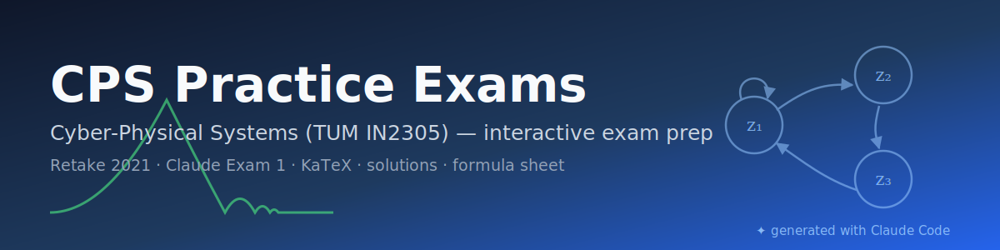

<p align="center"></p>

<p align="center">
  
  
  
  
</p>

# CPS Practice Exams

React + React Router + KaTeX app with practice problems for IN2305 Cyber-Physical
Systems (TUM, Althoff), grouped by the four exam sections. Contains the ported &
solved retake exam of 15 Oct 2021 plus **Claude Exam 1** — new problems generated
in the same style, with worked solutions.

## Run

```sh
npm install     # once
npm run dev     # dev server, http://localhost:5173
```

Or with Docker:

```sh
docker build -t cps-practice-exams .
docker run --rm -p 8080:80 cps-practice-exams   # http://localhost:8080
```

`npm run build` writes a static site to `dist/` (hash routing — works from any
static host or opened via `npm run preview`).

## Views

- **By topic** — `#/short-questions`, `#/discrete-systems`, `#/continuous-systems`,
  `#/hybrid-systems`: both exams' problems for one section.
- **Full exams (one page)** — `#/exam/retake-2021` and `#/exam/claude-exam-1`:
  all four problems of one exam on a single page.
- **Formula sheet** — the "📄 Formula sheet" toolbar button opens the permitted
  CPS formula sheet (`public/formula-sheet.pdf`) in a sticky panel on the right.

## Structure

- `public/questions.json` — all problem content. Top-level `exams` defines the
  exam ids/labels (`retake-2021`, `claude-exam-1`); each problem carries an
  `exam` field. Text supports inline LaTeX (`$...$`), `**bold**`, `*italic*`;
  block types: `p`, `math` (display LaTeX), `fig`, `subq`, `mc`, `ul`/`ol`, `table`.
- `public/images/*.svg` — figures (stroke `currentColor`, inlined at runtime so
  they follow light/dark theme).
- `src/` — app code: `App.jsx` (routes, progress), `Blocks.jsx` (JSON → React),
  `Math.jsx` (KaTeX), `Figure.jsx` (SVG loader).
- `public/legacy.html` — the earlier single-file version of this page.

Progress ("done" checkboxes) is stored in `localStorage`.

To add a problem: append it to the right section/group in `questions.json`
(unique `id`), drop any figure into `public/images/`, done — no code changes.

## Notes on content & attribution

- The Retake-2021 problems and the formula sheet originate from the TUM course
  IN2305 (Prof. Althoff) and are included for **personal exam preparation**;
  rights to that material remain with their authors.
- Claude Exam 1 problems, all worked solutions, figures, and the app itself were
  generated with [Claude Code](https://claude.com/claude-code) (Claude Fable 5).
  Solutions are unofficial — verify the calculation steps yourself.
